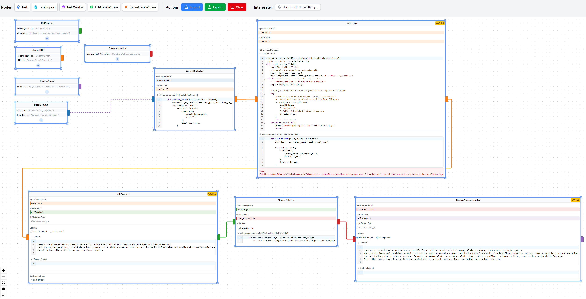

# PlanAI Editor

[](https://badge.fury.io/py/planaieditor)
[](https://opensource.org/licenses/Apache-2.0)
[](https://pypi.org/project/planaieditor/)
[](https://github.com/provos/planaieditor/actions/workflows/ci_cd.yml)

A graphical user interface (GUI) for visually building and managing AI workflows using the [PlanAI](https://github.com/provos/planai) framework.

## Overview

This application provides a node-based interface, built with Svelte 5 and svelte-flow, allowing users to:

*   Visually construct PlanAI graphs by creating and connecting Task, TaskWorker, LLMTaskWorker, and JoinedTaskWorker nodes.
*   Configure the properties of each node.
*   Export the designed graph into a Python module compatible with PlanAI.
*   Import existing PlanAI Python modules into the visual editor for modification.
*   Execute a PlanAI graph within the UI and see its output

The backend is powered by Python using Flask and Flask-SocketIO to handle graph processing and communication with the PlanAI framework.

## Screenshot



## Features

*   **Visual Graph Creation:** Drag and drop interface to build PlanAI workflows.
*   **Python Export:** Generate runnable Python code from your visual graph.
*   **Python Import:** Load existing PlanAI Python files into the editor for visualization and modification. (Backend uses `ast` module for parsing and patching).

## Installation

The easiest way to install the PlanAI Editor is using pip:

```bash
pip install planaieditor
```

**Prerequisites:** You need Python 3.10+ installed.

## Usage

Once installed, run the application from your terminal:

```bash
planaieditor
```

Then, open your web browser and navigate to `http://localhost:5001`.

## Development

This section is for developers who want to contribute to the PlanAI Editor or run it from the source code.

**Prerequisites:**

*   Python 3.10+
*   Node.js and [npm](https://www.npmjs.com/) (Node Package Manager)
*   [Poetry](https://python-poetry.org/) for Python package management.

**Setup:**

1.  **Clone the repository:**
    ```bash
    git clone https://github.com/provos/planaieditor.git
    cd planaieditor
    ```
2.  **Backend Setup:**
    ```bash
    cd backend
    poetry install --with dev # Install main and development dependencies
    cd ..
    ```
3.  **Frontend Setup:**
    ```bash
    cd frontend
    npm install
    cd ..
    ```

### Running in Development Mode

This mode runs the frontend and backend separately, allowing for hot-reloading when code changes are made.

1.  **Run the Backend (Development Mode):**
    *   Open a terminal in the `backend` directory.
    *   Set the `FLASK_ENV` environment variable to `development`.
      *   On Linux/macOS: `export FLASK_ENV=development`
      *   On Windows (Command Prompt): `set FLASK_ENV=development`
      *   On Windows (PowerShell): `$env:FLASK_ENV = "development"`
    *   Run the backend using Poetry:
        ```bash
        poetry run python app.py
        ```
        *(Keep this terminal running)*

2.  **Run the Frontend Development Server:**
    *   Open *another* terminal in the `frontend` directory.
    *   Run the development server:
        ```bash
        npm run dev -- --open
        ```
        *(Keep this terminal running)*

    This will usually open your browser automatically to `http://localhost:5173`.

### Building and Running the Packaged Application from Source

This describes how to build the frontend, package the application, and run it locally from the built package. This is useful for testing the final build process before publishing.

1.  **Build the Frontend:**
    *   Navigate to the `frontend` directory and build the static assets:
        ```bash
        cd frontend
        # npm install # If you haven't already
        npm run build
        cd ..
        ```
2.  **Build the Python Package:**
    *   Navigate to the `backend` directory.
    *   Use Poetry to build the wheel file. This includes the frontend build assets.
        ```bash
        cd backend
        poetry build
        ```
    *   This creates a `.whl` file in the `backend/dist/` directory.

3.  **Install the Local Package:**
    *   Install the built wheel file using pip (ideally in a separate virtual environment):
        ```bash
        # Example: Install from the dist directory
        pip install backend/dist/planaieditor-*.whl
        ```

4.  **Run the Locally Built Application:**
    *   Run the installed application:
        ```bash
        planaieditor
        ```
    *   Navigate to `http://localhost:5001` in your web browser.

## Technologies Used

*   **Frontend:** Svelte 5, SvelteKit, svelte-flow, Monaco Editor, TypeScript
*   **Backend:** Python 3.10+, Flask, Flask-SocketIO
*   **Core AI Framework:** PlanAI

## Contributing

Contributions are welcome! Please feel free to open issues or submit pull requests. (Optional: Add contribution guidelines if you have them).

## License

Apache 2.0
