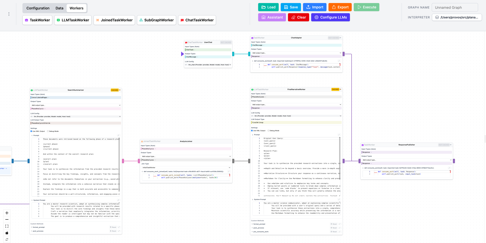

# PlanAI Editor

[](https://opensource.org/licenses/Apache-2.0)

A graphical user interface (GUI) for visually building and managing AI workflows using the [PlanAI](https://github.com/provos/planai) framework.

## Overview

This application provides a node-based interface, built with Svelte 5 and svelte-flow, allowing users to:

*   Visually construct PlanAI graphs by creating and connecting Task, TaskWorker, LLMTaskWorker, and JoinedTaskWorker nodes.
*   Configure the properties of each node.
*   Export the designed graph into a Python module compatible with PlanAI.
*   Import existing PlanAI Python modules into the visual editor for modification.

The backend is powered by Python using Flask and Flask-SocketIO to handle graph processing and communication with the PlanAI framework.

## Screenshot



## Features

*   **Visual Graph Creation:** Drag and drop interface to build PlanAI workflows.
*   **Python Export:** Generate runnable Python code from your visual graph.
*   **Python Import:** Load existing PlanAI Python files into the editor for visualization and modification. (Backend uses `ast` module for parsing and patching).

## Technologies Used

*   **Frontend:** Svelte 5, SvelteKit, svelte-flow, Monaco Editor, TypeScript
*   **Backend:** Python 3.10+, Flask, Flask-SocketIO
*   **Core AI Framework:** PlanAI

## Getting Started (Preliminary)

**Prerequisites:**

*   Python 3.10+
*   Node.js and [npm](https://www.npmjs.com/) (Node Package Manager)

**Installation:**

1.  **Clone the repository:**
    ```bash
    git clone https://github.com/provos/planaieditor.git
    cd planaieditor
    ```
2.  **Backend Setup:**
    ```bash
    cd backend
    poetry install
    cd ..
    ```
3.  **Frontend Setup:**
    ```bash
    cd frontend
    npm install
    cd ..
    ```

## Usage

There are two main ways to run the application:

### 1. Development Mode

This mode runs the frontend and backend separately, allowing for hot-reloading during development.

1.  **Run the Backend (Development Mode):**
    *   Open a terminal in the `backend` directory.
    *   Set the `FLASK_ENV` environment variable to `development`.
      *   On Linux/macOS: `export FLASK_ENV=development`
      *   On Windows (Command Prompt): `set FLASK_ENV=development`
      *   On Windows (PowerShell): `$env:FLASK_ENV = "development"`
    *   Run the backend:
        ```bash
        poetry run python app.py
        ```
        *(Keep this terminal running)*

2.  **Run the Frontend Development Server:**
    *   Open *another* terminal in the `frontend` directory.
    *   Run the development server:
        ```bash
        npm run dev -- --open
        ```
        *(Keep this terminal running)*

    This will usually open your browser automatically to `http://localhost:5173`. Changes to the frontend code will trigger automatic updates.

### 2. Building and Running the Packaged Application (Distribution/Usage)

This mode builds the frontend into static files, bundles them with the Python backend into a standard Python package (wheel), and provides a command-line entry point to run the application.

1.  **Build the Frontend:**
    *   Make sure you have Node.js and npm installed.
    *   Navigate to the `frontend` directory and build the static assets:
        ```bash
        cd frontend
        npm install  # If you haven't already
        npm run build
        cd ..
        ```
2.  **Build the Python Package:**
    *   Navigate to the `backend` directory.
    *   Use Poetry to build the wheel file. This will trigger the `setup.py` script, which copies the frontend build into the package.
        ```bash
        cd backend
        poetry build
        ```
    *   This creates a `.whl` file in the `backend/dist/` directory (e.g., `backend/dist/planaieditor-0.1.0-py3-none-any.whl`).

3.  **Install the Package:**
    *   You can install the built wheel file using pip (ideally in a virtual environment):
        ```bash
        # Example: Install from the dist directory
        pip install backend/dist/planaieditor-*.whl
        ```

4.  **Run the Application:**
    *   Once installed, you can run the application using the command defined in `pyproject.toml`:
        ```bash
        planaieditor
        ```
    *   This will start the backend server, serving the bundled frontend.
    *   Navigate to `http://localhost:5001` (or the address shown in the console) in your web browser.

## Contributing

Contributions are welcome! Please feel free to open issues or submit pull requests. (Optional: Add contribution guidelines if you have them).

## License

Apache 2.0
